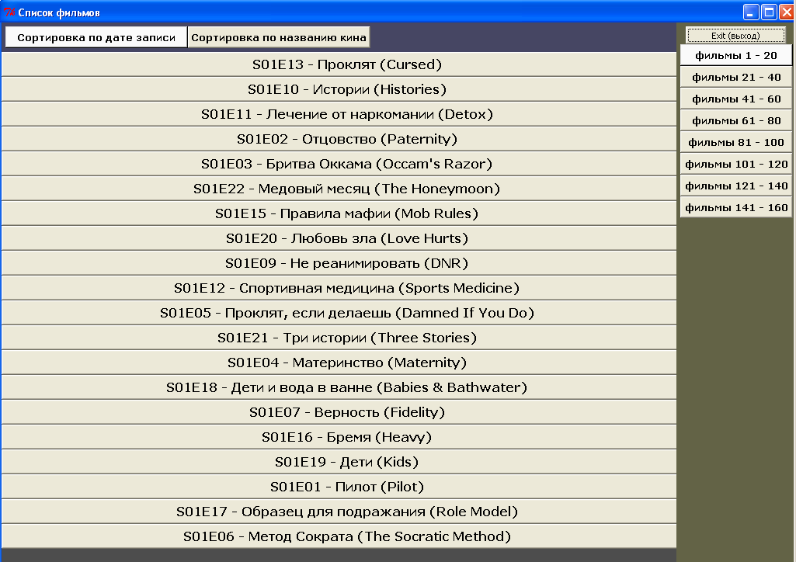
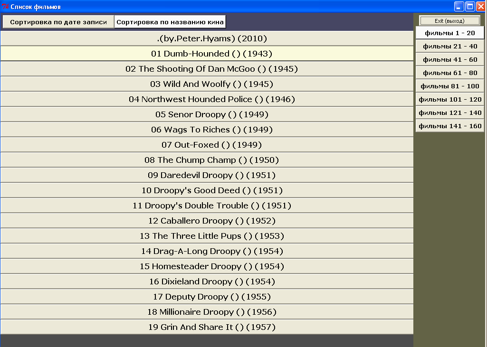

movieshell
==========

UI for movies collection on ext. USB drive

If you have some ext. USB drive with movies, like avi/mp4/mkv or maybe iso (video DVD image)
and you need to simplify access to that library,
movieshell can help.

Screenshots

Copy files and folders from folder `driveroot` into root folder of your USB ext. drive.

to be continued

Links

* http://vasnake.blogspot.ru/2013/02/movieshell.html
* http://vasnake.blogspot.ru/2011/11/linux.html
* http://vasnake.blogspot.ru/2012/04/maximized-window.html
* http://vasnake.blogspot.ru/2011/10/getlogicaldrives.html
* http://vasnake.blogspot.ru/2010/12/magnate.html
